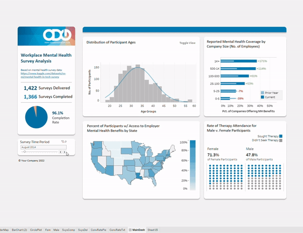

# tableau_sample
This custom-made Tableau dashboard provides a sample of my data visualization work, using dynamic filtering and various charts to 
deliver at-a-glance insights 
(please note that the underlying data is public mental health survey data from Kaggle.com and not tied to any company in any way).

